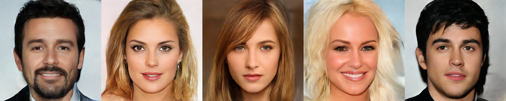

# Invertible Hierarchical Generative Model for Images


<figure>
    <p align="center">
        
        <br>
    </p>
</figure>

__Invertible Hierarchical Generative Model for Images__ \
Heikki Timonen, Miika Aittala, Jaakko Lehtinen \
[Paper](https://openreview.net/pdf?id=4rkKN4tM63)

## Setup

### Requirements
Training a 256x256-resolution model with batch-size 4 requires an NVIDIA GPU with more than 12 GB of VRAM. Training a 128x128 model with batch-size 4 requires around 7 GB of VRAM. Training with a smaller batch-size or with decreased model capacity may work but might not replicate the results of the paper.

Running inference on a pre-trained model requires much less memory.

### Environment
Create the environment using the given template. This will also make the code visible in python as the hflow-module.

```
conda env create -f environment.yml
conda activate hflow
```


## Usage

### Training a model
The following steps show how to create a dataset from a zipfile of images and train a model. We create the dataset to <DATASET_PATH> and name it <DATASET_NAME>. 

1. Generate a training dataset from a zip-archive of images

```
python scripts/generate_dataset.py --path <PATH_TO_IMAGE_ZIPFILE> \
--dataset_path <DATASET_PATH> \ 
--dataset_name <DATASET_NAME> \
--resolution <RESOLUTION>
```

_Optionally_, to compute FIDs during training, fetch the StyleGAN3 codebase and download the inception-net checkpoint. 

```
git clone https://github.com/NVlabs/stylegan3.git
wget https://api.ngc.nvidia.com/v2/models/nvidia/research/stylegan3/versions/1/files/metrics/inception-2015-12-05.pkl
```


2. Run training using preset settings from preset_configs. By default a single GPU is used. __The example config_A_256 assumes resolution 256x256 for the data.__

```
python scripts/train.py --config preset_configs/config_A_256.json \
--data_path <DATASET_PATH> \
--data_name <DATASET_NAME>
```

_Optionally_, add the following to the above to compute FIDs and __ensure that the StyleGAN-module can be found in PYTHONPATH__:
```
--inception_net_path <PATH_TO_DOWNLOADED_PKL_FILE>
```

By default, images are generated every 30 minutes, checkpoint written every 4 hours and metrics computed every 4 hours. You may change these rates with

```
--images_every_hours <TIME_IN_HOURS>
--metrics_every_hours <TIME_IN_HOURS>
--checkpoint_every_hours <TIME_IN_HOURS>
```
when using scripts/train.py. A single checkpoint-file can take several hundreds of MBs of disk space so they should not be created too frequently.
 
 You can continue the training of a previously save model by additionally giving
 ```
--continue_folder <PATH_TO_CHECKPOINT_FOLDER_OF_A_PREVIOUS_RUN>
 ```
 from which the latest checkpoint is chosen as the initialization for the training. Note that one might need to lower the default learning rates when continuing training from saved checkpoints due to the learning rate decay in the training.

### Tensorboard
By default, the training code generates a `TB`-folder that contains a tensorboard-file of FIDs, learning rates and likelihood-bounds.


### Pretrained models
See [Releases](https://github.com/timoneh/hflow/releases/tag/v1.0.0).


### Examples of evaluating a model

#### Sample images using a trained model and save as .png

```
python scripts/sample.py --path <PATH_TO_MODEL_CHECKPOINT> \
--n_samples <NUMBER_OF_SAMPLES> \
--sample_std <PRIOR_STANDARD_DEVIATION>
```
A reasonable range for `<PRIOR_STANDARD_DEVIATION>` is 0.5-0.9 with larger values yielding more variance but also often increasingly broken images.

#### Interpolation between two images in the latent space of the model and save the output as a video
```
python scipts/interpolate.py --path <PATH_TO_MODEL_CHECKPOINT> \
--path_to_img1 <PATH_TO_IMAGE_1> \
--path_to_img2 <PATH_TO_IMAGE_2> \
--n_steps <NUMBER_OF_FRAMES> \
--frames_per_second <FPS_IN_OUTPUT>
```
The images are automatically resized to match the resolution with which the network was trained. Only images with 1x1 aspect ratio are supported.

#### Encoding and decoding an image to and from the latent space

```
import hflow

model = hflow.Wrapper.from_path(<PATH_TO_MODEL_CHECKPOINT>)
image = model.load_img(<PATH_TO_IMAGE_PNG>) # of shape [1, 3, resolution, resolution]. Batches of images are also supported.
latent = model.inverse(image) # could manipulate the latent code here
latent_decoded = model.forward(latent) # should match the original 'image'-variable. Out-of-distribution images can have poor reconstructions.
```


## License
This work in this repository is licensed under the Apache 2.0 license. The [StyleGAN3](https://github.com/NVlabs/stylegan3)-codebase used in the FID-computation is licensed under the Nvidia Source Code License.


## Citation
```
@article{
timonen2023invertible,
title={Invertible Hierarchical Generative Model for Images},
author={Heikki Timonen and Miika Aittala and Jaakko Lehtinen},
journal={Transactions on Machine Learning Research},
issn={2835-8856},
year={2023},
url={https://openreview.net/forum?id=4rkKN4tM63},
note={}
}
```


## Acknowledgements
We thank Pauli Kemppinen and Erik Härkönen for help with the code release. This work was partially supported by the European Research Council (ERC Consolidator Grant 866435), and made use of computational resources provided by the Aalto Science-IT project.

